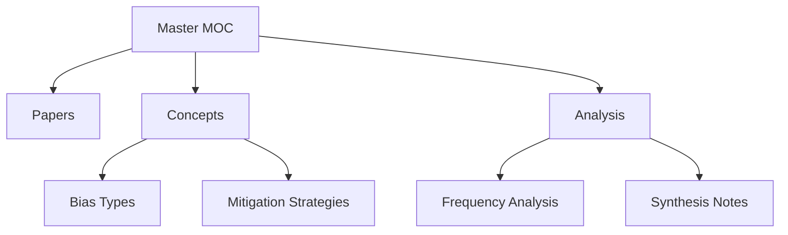

# 🎯 MASTER MOC - Complete Vault Navigation

```
RESEARCH QUESTION:
How can feminist Digital/AI Literacies and diversity-reflective
prompting help to expose and mitigate bias and intersectional
discrimination in AI technologies?
```

## 📊 Vault Statistics

| Papers | Concepts | High-Freq | Categories |
|:------:|:--------:|:---------:|:----------:|
| **11** | **16** | **4** | **3** |

## 🗺️ Navigation Structure



## 🔥 Top Concepts by Category

### Bias Types (Top 10)
1. [[Intersectionality]] `65x`
2. [[Discrimination]] `16x`
3. [[Algorithmic Bias]] `5x`
4. [[Stereotyping]] `4x`
5. [[Algorithmic Discrimination]] `2x`
6. [[Stereotypical]] `2x`
7. [[Demographic]] `1x`
8. [[Systematic Bias]] `1x`

### Mitigation Strategies (Top 10)
1. [[Intersectionality]] `65x`
2. [[Feminist AI]] `16x`
3. [[Prompt Engineering]] `16x`
4. [[Bias Mitigation]] `8x`
5. [[Debiasing]] `7x`
6. [[Fine-tuning]] `5x`
7. [[Inclusive Ai]] `4x`
8. [[Bias Evaluation]] `3x`
9. [[Equitable Outcomes]] `2x`
10. [[Equitable Ai]] `2x`

## 📚 Recent Papers (2024-2025)


## 💡 Key Research Themes

Based on concept frequency analysis:

3. **Prompting Solutions**: Prompt-based mitigation discussed 16x

## ⚡ Quick Links

### Core MOCs
- [[Index]] - Main navigation index
- [[Concept_Frequency]] - Frequency analysis
- [[Papers Index]] - All papers by year

### Your Workspace
- [[Synthesis/]] - Add your analysis here
- [[Research Notes]] - Create your notes
- [[Questions]] - Track open questions

## 🔍 Useful Searches

Copy these into Obsidian search:

- `tag:#paper` - All research papers
- `tag:#concept` - All concepts
- `/\[\[.*Bias\]\]/` - Papers mentioning bias types
- `/frequency: [0-9]{2,}/` - High-frequency concepts
- `path:Synthesis` - Your synthesis notes

---

*Vault generated: 2025-10-31 19:18*  
*Total files: 32 | Python script: `generate_obsidian_vault_improved.py`*
