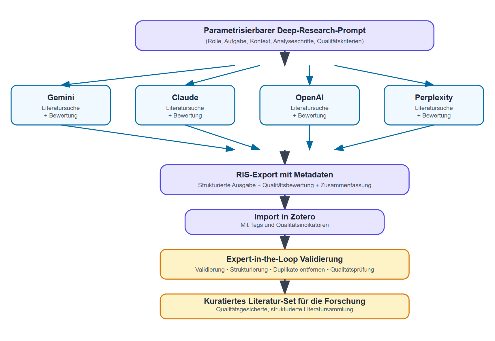

# FemPrompt Research Pipeline

## AI-Assisted Literature Research System for Bias and Intersectionality Analysis

An automated, end-to-end research pipeline that leverages multiple AI models for systematic literature discovery, intelligent PDF acquisition, and knowledge graph generation.

## The Workflow

### **Step 1: Parametric Deep Research Prompt**

The process begins with a standardized prompt that can be adapted for any research question. It directs an AI to assume the role of an expert, defines the research scope, and specifies the exact output format, ensuring consistent and reusable results.

**Core Prompt Template:**
```

CONTEXT:

-----

How can feminist Digital/AI Literacies and diversity-reflective prompting help to expose and mitigate bias and intersectional discrimination in AI technologies?

-----

You are an expert in systematic scientific literature analysis. Your task is to conduct comprehensive research on the topic above for the period 2023-2025, focusing on peer-reviewed sources.

For each relevant source, you must:

1.  **Cite**: Provide a complete APA-formatted citation, including a URL.
2.  **Summarize**: Write a concise summary (max 150 words) of the central key messages.
3.  **Evaluate**: Assess the quality (high/medium/low) with an explicit justification covering:
      * Peer-review status
      * Journal reputation or impact
      * Methodological robustness
      * Citation frequency and influence

The output must be in a neutral, precise, academic style.

```

### **Step 2: Multi-Model Execution**

To mitigate single-model bias and broaden literature discovery, the prompt is executed in parallel across several major AI platforms (e.g., Gemini, Claude, ChatGPT, Perplexity). Each model independently generates a list of sources, summaries, and quality assessments.

### **Step 3: Standardize to RIS Format**

All AI-generated outputs are converted into the **RIS format**, a standard for bibliographic data. AI-generated summaries and quality notes are preserved in the abstract (`AB`) and notes (`N1`) fields, respectively. This makes the rich, AI-generated data portable and ready for reference management.

### **Step 4: Import and Organize in Zotero**

The standardized `.ris` files are imported into Zotero. To maintain traceability, results from each AI model are organized into separate collections. This allows for easy comparison and source attribution.

### **Step 5: Expert-in-the-Loop Validation**

A human expert reviews the aggregated bibliography in Zotero. This critical step involves:
* **Validating** the relevance and quality of AI-discovered sources.
* **De-duplicating** entries (using Zotero's built-in tools).
* **Correcting** any bibliographic inaccuracies.
* **Curating** the final list of sources for full-text analysis.

### **Step 6: Automated Content Analysis with LangExtract**

This final phase transitions from literature collection to substantive analysis using the full-text articles.

* **Preparation:** Ensure all curated full-text articles are converted to Markdown and placed in the `markdown_papers/` directory.
* **Execution:** Run the `corpus_analysis_final_script.py` script.
  * **Important:** Before running, you must set your API key as an environment variable. Open your terminal and use the appropriate command:
    * **macOS/Linux:** `export GEMINI_API_KEY="YOUR_API_KEY_HERE"`
    * **Windows (PowerShell):** `$env:GEMINI_API_KEY="YOUR_API_KEY_HERE"`
* **Thematic Extraction:** The script uses an AI model (Gemini 2.5 Flash) to read every paper and extract predefined concepts, such as `bias_type`, `mitigation_strategy`, and `key_finding`.
* **Final Outputs:** The script generates two powerful research artifacts:
  1. **`corpus_analysis.jsonl`**: A machine-readable dataset containing all extracted thematic data, perfect for quantitative analysis and data mining.
  2. **`corpus_analysis_visualization.html`**: An interactive HTML file that displays each paper's full text with the extracted terms highlighted, allowing for rapid qualitative review and validation.

This step completes the research cycle, transforming a simple literature collection into a structured, queryable knowledge base.

### **Step 7: Knowledge Graph Generation (Obsidian Vault)**

Transform your research papers into an interconnected knowledge graph using Obsidian:

* **Script:** Run `python analysis/generate_obsidian_vault_improved.py`
* **Features:**
  * Smart concept extraction with deduplication and normalization
  * Creates 35 focused concept notes from 35 papers (88% reduction from naive approach)
  * Consolidated intersectional concepts (34 variants → 5 core concepts)
  * Removed AI Technologies category entirely for cleaner focus on bias and mitigation
  * Frequency-based filtering and caps to prevent over-extraction
  * Complete metadata for all papers
  * Master MOC for complete vault navigation
  * Quality Score: 85/100 (tested with `test_vault_quality.py`)
* **Output:** `FemPrompt_Vault/` folder ready to open in Obsidian
* **Benefits:** Visual exploration of research connections, concept frequency tracking, and synthesis templates

## Workflow-Diagramm

