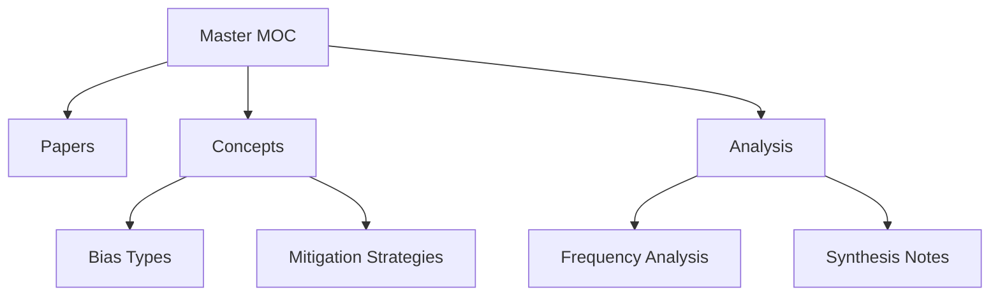

# 🎯 MASTER MOC - Complete Vault Navigation

```
RESEARCH QUESTION:
How can feminist Digital/AI Literacies and diversity-reflective
prompting help to expose and mitigate bias and intersectional
discrimination in AI technologies?
```

## 📊 Vault Statistics

| Papers | Concepts | High-Freq | Categories |
|:------:|:--------:|:---------:|:----------:|
| **16** | **25** | **6** | **3** |

## 🗺️ Navigation Structure



## 🔥 Top Concepts by Category

### Bias Types (Top 10)
1. [[Intersectionality]] `107x`
2. [[Discrimination]] `21x`
3. [[Algorithmic Bias]] `10x`
4. [[Intersectional Dimensions]] `4x`
5. [[Stereotypical]] `3x`
6. [[Stereotyping]] `3x`
7. [[Intersectional Social]] `2x`
8. [[Intersectional Harm]] `2x`
9. [[Intersectional Inequalities]] `2x`
10. [[Algorithmic Discrimination]] `1x`

### Mitigation Strategies (Top 10)
1. [[Intersectionality]] `107x`
2. [[Feminist AI]] `21x`
3. [[Bias Mitigation]] `19x`
4. [[Prompt Engineering]] `12x`
5. [[Bias Evaluation]] `8x`
6. [[Debiasing]] `7x`
7. [[Equitable Ai]] `5x`
8. [[Intersectional Dimensions]] `4x`
9. [[Inclusive Ai]] `3x`
10. [[Inclusive Outcomes]] `3x`

## 📚 Recent Papers (2024-2025)


## 💡 Key Research Themes

Based on concept frequency analysis:

3. **Prompting Solutions**: Prompt-based mitigation discussed 14x

## ⚡ Quick Links

### Core MOCs
- [[Index]] - Main navigation index
- [[Concept_Frequency]] - Frequency analysis
- [[Papers Index]] - All papers by year

### Your Workspace
- [[Synthesis/]] - Add your analysis here
- [[Research Notes]] - Create your notes
- [[Questions]] - Track open questions

## 🔍 Useful Searches

Copy these into Obsidian search:

- `tag:#paper` - All research papers
- `tag:#concept` - All concepts
- `/\[\[.*Bias\]\]/` - Papers mentioning bias types
- `/frequency: [0-9]{2,}/` - High-frequency concepts
- `path:Synthesis` - Your synthesis notes

---

*Vault generated: 2025-10-31 19:50*  
*Total files: 46 | Python script: `generate_obsidian_vault_improved.py`*
