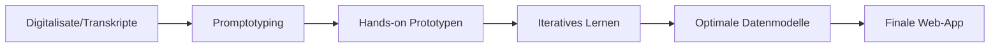

# Barbara Denicolò - Hof Herzog Sigmunds von Tirol (1427–1496)

## 📋 Projekt-Übersicht

**Forscherin**: Barbara Denicolò  
**Zeitraum**: Herzog Sigmund von Tirol (1427–1496)  
**Status**: Forschungsantrag eingereicht  
**Budget**: 10.000–15.000 Euro (geschätzt)  
**Meeting**: 7. Oktober 2025

## 🎯 Forschungsfrage & Ansatz

### Kernthema
Untersuchung des Hofes Herzog Sigmunds von Tirol als **sozio-materielles Gefüge** mit einem neuen Ansatz für die Hofgeschichtsforschung.

### Methodischer Ansatz
- **Praxeologische Perspektiven**: Handlungs- und praxisorientierte Analyse
- **Akteurzentrierte Perspektiven**: Fokus auf historische Akteure und ihre Interaktionen
- **Digitale Methoden**: Kombination traditioneller Geschichtswissenschaft mit digitalen Tools

## 🔧 Technische Komponenten

### Quellenerschließung
1. **HTR** (Handwritten Text Recognition)
2. **NER** (Named Entity Recognition)
3. **Event Extraction**

### Quellenbasis
- Rechnungen
- Hof- und Tischordnungen
- Inventare
- Korrespondenzen

**Status**: Digitalisate und Transkripte liegen bereits vor ✓

## 💡 Promptotyping-Ansatz

### Konzept
**Promptotyping** = LLM-unterstütztes, extrem schnelles Prototyping

### Workflow

### Vorteile
- **Hands-on Consulting**: Lernen durch praktisches Arbeiten
- **Iterative Entwicklung**: Kontinuierliche Verbesserung
- **Schnelle Prototypen**: Rasche Validierung von Konzepten

## 🌐 Finale Plattform

### Zielprodukt
Web-App/Plattform zur:
- **Datenvisualisierung**
- **Datenanalyse**
- Interaktive Exploration des höfischen Gefüges

### Entwicklungsprozess
1. Prototyping-Phase (LLM-gestützt)
2. Konzeptionsphase
3. Implementierungsphase

## ❓ Offene Fragen (Meeting 7.10.2025)

### Zu klärende Punkte
- [ ] Ist der Antrag bewilligt?
- [ ] Welches Budget steht zur Verfügung?
- [ ] Wer übernimmt HTR/NER/Event Extraction?
- [ ] Welche digitalen Komponenten sind konkret geplant?

## 💰 Budget

**Geschätzter Gesamtumfang**: 10.000–15.000 Euro

### Vermutete Kostenverteilung
- HTR/NER/Event Extraction: ?
- Promptotyping & Consulting: ?
- Web-App Entwicklung: ?
- Infrastruktur & Hosting: ?

## 🔗 Verbindungen

### Methodische Links
- [[Prompt Engineering]] - Kernmethode des Promptotyping
- Digital Humanities Methoden
- Historische Netzwerkanalyse

### Ähnliche Projekte
- *Zu ergänzen nach Meeting*

## 📝 Notizen

### Besonderheiten
- Bereits vorhandene Digitalisate/Transkripte = gute Ausgangslage
- Innovativer Ansatz durch LLM-Integration in geschichtswissenschaftliche Forschung
- Verbindung von traditioneller Hofgeschichte mit digitalen Methoden

### Nächste Schritte
1. Meeting-Ergebnisse dokumentieren
2. Budget-Detailplanung
3. Verantwortlichkeiten klären
4. Technische Spezifikationen definieren

---

## 📅 Timeline

| Datum | Ereignis | Status |
|-------|----------|--------|
| vor 07.10.2025 | Antragstellung | ✓ |
| 07.10.2025 | Meeting | durchgeführt |
| TBD | Bewilligungsentscheidung | ausstehend |
| TBD | Projektstart | geplant |

---

*Erstellt: 2025-10-07*  
*Letzte Aktualisierung: 2025-10-07*  
*Status: Awaiting Meeting Results*
