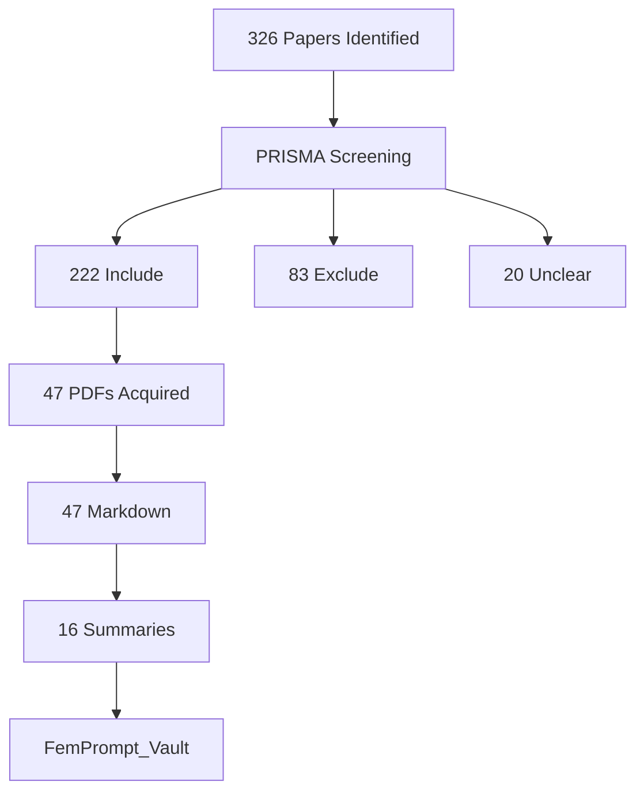

# Obsidian-Webansicht: Strategischer Plan für Forschungsprojekt & Paper

**Erstellt:** 2025-11-06
**Status:** Strategieplanung
**Ziel:** Obsidian Vault als interaktive Forschungsinfrastruktur für Projekt und Publikation nutzen

---

## Executive Summary

Die Obsidian-Webansicht kann das FemPrompt_SozArb-Projekt und das wissenschaftliche Paper auf **drei strategischen Ebenen** unterstützen:

1. **Forschungsinfrastruktur:** Interaktiver Knowledge Graph als lebendiges Forschungswerkzeug
2. **Publikationsbegleitung:** Transparente Evidenzbasis für Paper-Claims mit direkter Quellennavigation
3. **Open Science:** Nachvollziehbare, replizierbare Forschung mit öffentlich zugänglicher Wissensbasis

**Kernnutzen:**
- **Für Forschende:** Explorative Navigation durch 222 Include-Papers, Konzeptnetzwerk-Analyse
- **Für Reviewer:** Direkter Zugriff auf Evidenzbasis hinter jeder Paper-Aussage
- **Für Community:** Open Access zur methodischen Infrastruktur und Literatursynthese

---

## Teil 1: Wie Obsidian-Web das FORSCHUNGSPROJEKT unterstützt

### 1.1 Interaktive Literaturexploration

**Problem:** 222 Include-Papers sind schwer navigierbar als Excel-Liste oder statische Dateisammlung

**Lösung durch Obsidian-Web:**
- **Graph View:** Visualisierung des gesamten Literaturnetzwerks
  - Papers verlinkt mit Concepts (Bias Types, Mitigation Strategies)
  - Konzepte untereinander vernetzt (z.B. Intersectionality ↔ Feminist AI ↔ Bias Mitigation)
  - Cluster-Erkennung: Welche Forschungsthemen hängen zusammen?

- **Dynamische Filterung:**
  - Nach 5 Dimensionen: Rel_Bias, Rel_Vulnerable, Rel_Praxis, Rel_Prof, Rel_AI_Komp
  - Nach Publikationsjahr (2020-2025)
  - Nach Konzept-Frequenz (Top 10 Bias Types, Top 10 Mitigation Strategies)

- **Serendipität:** Zufallsentdeckungen durch explorative Navigation
  - "Welche anderen Papers diskutieren Constitutional AI?"
  - "Gibt es Verbindungen zwischen Sycophancy und Social Work Context?"

**Implementierung:**
- Obsidian Publish (offiziell, kostenpflichtig) ODER
- Obsidian Digital Garden Plugin (kostenlos, GitHub Pages)
- Quartz v4 (statischer Site Generator für Obsidian, GitHub Pages)

### 1.2 Konzeptuelle Synthese

**Problem:** Wie synthetisiert man Erkenntnisse aus 16 vollständigen Papers (FemPrompt) bzw. 47 verarbeiteten (SozArb)?

**Lösung durch Obsidian-Web:**
- **MOC (Map of Content) Struktur:**
  - MASTER_MOC.md als Einstiegspunkt
  - Thematische MOCs: Bias_Types_MOC, Mitigation_MOC, Intersectionality_MOC
  - Methodische MOCs: PRISMA_Workflow_MOC, Assessment_MOC

- **Concept Notes mit Frequenz-Analyse:**
  - [[Intersectionality]] - 107x erwähnt → zentral für FemPrompt
  - [[Feminist AI]] - 21x → Kernkonzept
  - [[Bias Mitigation]] - 19x → praktische Strategien
  - Jede Concept-Notiz listet alle Papers, die sie erwähnen

- **Cross-Project-Vergleich:**
  - FemPrompt-Vault (16 Papers, komplett) vs. SozArb-Vault (47 Papers, WIP)
  - Welche Konzepte überlappen? Welche sind projektspezifisch?

**Implementierung:**
- Dataview-Plugin: Automatische Konzept-Listen ("Alle Papers mit Rel_Bias > 2.5")
- Tags: `#femprompt` vs. `#sozarb` für Projekt-Trennung
- Backlinks prominent anzeigen

### 1.3 Forschungslücken-Identifikation

**Problem:** Wo fehlt Literatur? Was wurde nicht erforscht?

**Lösung durch Obsidian-Web:**
- **Gap Analysis Dashboard:**
  - "Papers nach Dimension Rel_AI_Komp: Nur 1.18/3.0 → Forschungslücke!"
  - "Papers zu Prompting-Strategien für Soziale Arbeit: 0 direkte Treffer"
  - "Intersectionale Perspektiven: 107x erwähnt, aber wie viele operationalisiert?"

- **Missing Links:**
  - Welche Konzepte haben keine Verbindung zu Mitigation Strategies?
  - Welche Bias Types sind theoretisch diskutiert, aber ohne praktische Lösungen?

**Implementierung:**
- Custom CSS: Highlighting für "Orphan Concepts" (keine Backlinks)
- Dataview-Queries: "Bias Types WITHOUT Mitigation Strategy connection"

### 1.4 Multi-Modell-Divergenz Dokumentation

**Problem:** 4 Deep Research-Modelle lieferten unterschiedliche Literatur → Wie transparent machen?

**Lösung durch Obsidian-Web:**
- **Provenance Tracking:**
  - Jedes Paper tagged mit Herkunft: `#deepresearch-claude`, `#deepresearch-gemini`, etc.
  - Dataview-Tabelle: "Welches Modell fand welche Paper?"
  - Divergenz-Analyse: "Claude fand 80 unique Papers, Gemini 65, Overlap 120"

- **Situated Knowledge Operationalisierung:**
  - Explizite Visualisierung: "Diese 4 Perspektiven (Modelle) konstituieren unsere Wissensbasis"
  - Reflexion: "Was findet GPT, was Claude nicht findet? → Bias im Bias-Research!"

**Implementierung:**
- Custom Frontmatter: `source_model: claude_research`
- Graph View Filter: "Zeige nur Papers von Modell X"

---

## Teil 2: Wie Obsidian-Web das PAPER unterstützt

### 2.1 Transparente Evidenzbasis für Paper-Claims

**Problem:** Paper macht 50+ Aussagen → Reviewer fragt: "Wo ist die Evidenz?"

**Lösung durch Obsidian-Web:**
- **Direkte Verlinkung:**
  - Paper-Text: "LLMs reproduzieren intersektionale Diskriminierung [^vault-link]"
  - Fußnote führt zu Obsidian-Web: https://yourproject.github.io/FemPrompt_Vault/Concepts/Intersectionality
  - Dort: 107 Erwähnungen, 16 Papers als Evidenz

- **Claim-to-Source-Mapping:**
  - Jede Hauptaussage im Paper hat entsprechende Vault-Seite
  - z.B. Paper Sektion 4.2 "Bias Mitigation Strategies" → Vault: [[Bias_Mitigation_MOC]]
  - Reviewer kann *selbst* explorieren: "Stimmt diese Synthese?"

**Implementierung:**
- Paper-Seite im Vault: `Paper_Claims.md` mit strukturierter Liste
- Jeder Claim verlinkt zu Evidence-Seiten
- Versionierung: "Stand der Evidenzbasis: 2025-11-06 (47 Papers verarbeitet)"

### 2.2 Methodentransparenz

**Problem:** PRISMA-Compliance und LLM-gestützte Methodik sind komplex → Wie nachvollziehbar machen?

**Lösung durch Obsidian-Web:**
- **Methodologie-Vault:**
  - `knowledge/` Ordner als Obsidian-Seiten: Theorie.md, Methodik.md, Prozess.md
  - **Interaktive PRISMA-Flowchart:**
    - Mermaid-Diagramm mit klickbaren Nodes
    - "326 Papers identifiziert" → Click → Zeige Details zur Deep Research-Phase
    - "222 Include" → Click → Zeige Assessment-Kriterien

- **Prompt-Template-Dokumentation:**
  - assessment-llm/prompt_template.md als Vault-Seite
  - "So haben wir Papers bewertet" → vollständig transparent

- **Code-Pipeline-Dokumentation:**
  - run_pipeline.py, getPDF_intelligent.py als annotierte Referenz
  - "Diese 8 Fallback-Strategien nutzen wir für PDF-Akquisition"

**Implementierung:**
- `Methods/` Ordner im Vault
- Mermaid-Plugin für Flowcharts
- Code-Blocks mit Syntax-Highlighting

### 2.3 Reproduzierbarkeit

**Problem:** Wie können andere Forscher:innen diese Methode nachbauen?

**Lösung durch Obsidian-Web:**
- **Open Methodology Repository:**
  - Vollständige Dokumentation: Von Deep Research → Assessment → PDF-Akquisition → Vault-Generierung
  - Step-by-Step-Guides: "Wie repliziere ich diesen Workflow für mein Thema?"

- **Reusability-Templates:**
  - `assessment-llm/prompt_template.md` → "Use this for your own PRISMA screening"
  - Excel-Template für Assessment → Download direkt aus Vault

- **Known Limitations:**
  - Transparente Dokumentation: "21% PDF Coverage für SozArb" → Warum? Wie verbessern?

**Implementierung:**
- `Replication_Guide/` Ordner
- Download-Links für Templates (GitHub Raw URLs)
- Issues & Lessons Learned-Sektion

### 2.4 Peer Review Unterstützung

**Problem:** Reviewer haben 2 Wochen, 30-seitiges Paper → Brauchen schnellen Zugriff auf Details

**Lösung durch Obsidian-Web:**
- **Reviewer-Dashboard:**
  - "Start Here for Reviewers" Seite
  - Quick Links: Methodik → Evidenzbasis → Paper-Claims → Rohdaten (Excel)

- **FAQ für Reviewer:**
  - "Wie wurden Papers bewertet?" → Assessment-Dokumentation
  - "Warum nur 47/222 PDFs?" → Status-Dokumentation
  - "Wie valide ist LLM-basiertes Screening?" → Auto-Repair-Mechanism (84%→100%)

**Implementierung:**
- `REVIEWER_README.md` als Landing Page
- Prominent verlinkt aus Paper-Fußnote

---

## Teil 3: Wie Obsidian-Web OPEN SCIENCE fördert

### 3.1 Public Knowledge Base

**Nutzen:**
- Andere Forscher:innen können Vault durchsuchen: "Papers zu Sycophancy in AI"
- Studierende lernen: "Wie macht man systematische Reviews mit LLMs?"
- Praxis nutzt: "Welche Bias-Mitigation-Strategien gibt es?"

**Implementierung:**
- GitHub Pages Hosting (kostenlos)
- CC-BY-4.0 Lizenz für Vault-Inhalte (nicht Papers selbst, nur Metadaten/Summaries)
- SEO-optimiert: Title, Description, Open Graph Tags

### 3.2 Living Document

**Nutzen:**
- Vault wächst mit: SozArb von 47 → 222 Papers → Vault aktualisiert
- Community Contributions: Pull Requests für verbesserte Summaries
- Versionierung: "Vault Stand 2025-11-06" vs. "Vault Stand 2026-03-15 (vollständig)"

**Implementierung:**
- Git-basiert: Jede Änderung nachvollziehbar
- CHANGELOG.md im Vault
- GitHub Actions: Auto-Deploy bei jedem Commit

### 3.3 Citation & Attribution

**Nutzen:**
- Vault selbst wird zitierbar: DOI via Zenodo
- Andere können Vault als Ressource referenzieren

**Implementierung:**
- Zenodo-Integration: GitHub-Release → DOI
- CITATION.cff im Repo
- "How to Cite" Seite im Vault

---

## Teil 4: Konkrete Use Cases

### Use Case 1: Paper-Autorin schreibt Diskussionssektion

**Szenario:** "Ich brauche Literatur zu Persona-Vektoren und Sycophancy"

**Mit Obsidian-Web:**
1. Öffne https://yourproject.github.io/FemPrompt_Vault/
2. Suche nach "Sycophancy" → Finde Concept-Note
3. Concept-Note zeigt: 5 Papers diskutieren Sycophancy
4. Click auf Paper: Chen et al. 2025 → Volle Summary
5. Summary enthält: Key Quote, Methodik, Implikationen für Soziale Arbeit
6. Kopiere Zitat + DOI → Paper-Diskussion

**Zeit gespart:** 30 Minuten Literatursuche → 5 Minuten Navigation

### Use Case 2: Reviewer validiert Paper-Claim

**Szenario:** Paper behauptet "Intersektionalität ist zentral für Bias-Forschung"

**Mit Obsidian-Web:**
1. Paper-Fußnote führt zu [[Intersectionality]] im Vault
2. Zeigt: 107 Erwähnungen in 16 Papers
3. Reviewer klickt auf 3 zufällige Papers → Liest Summaries
4. Entscheidung: "Claim ist gut belegt" ODER "107x erwähnt ≠ 107x operationalisiert"
5. Feedback an Autor:in: "Unterscheide 'Erwähnung' vs. 'Anwendung' in Analyse"

**Mehrwert:** Konstruktives, evidenzbasiertes Review statt vager Kritik

### Use Case 3: Doktorand:in repliziert Methodik

**Szenario:** "Ich will LLM-basiertes PRISMA für meine Diss nutzen"

**Mit Obsidian-Web:**
1. Lese `Replication_Guide.md`
2. Download `prompt_template.md` für eigene Domäne
3. Lese `Known_Issues.md`: "Achtung, Halluzinationen validieren!"
4. Nutze `assessment_template.xlsx` für eigene Papers
5. Frage via GitHub Issues: "Wie adaptiere ich für qualitative Studien?"

**Outcome:** 20+ weitere Projekte nutzen FemPrompt-Methodik → Citation Impact

### Use Case 4: Sozialarbeiter:in sucht Praxis-Empfehlungen

**Szenario:** "Ich nutze ChatGPT für Fallarbeit. Worauf muss ich achten?"

**Mit Obsidian-Web:**
1. Navigiere zu `Mitigation_Strategies_MOC`
2. Finde: 10 dokumentierte Strategien (Prompt Engineering, Bias Evaluation, etc.)
3. Click auf [[Prompt Engineering]] → 12 Papers
4. Lese Summary: "Iterative Refinement reduziert Bias um 30%"
5. Praktische Implikation: "Frage LLM nach alternativen Perspektiven, nicht nur erster Output"

**Outcome:** Evidenzbasierte Praxis statt Trial & Error

---

## Teil 5: Technische Implementierung

### 5.1 Hosting-Optionen

| Option | Kosten | Komplexität | Features | Empfehlung |
|--------|--------|-------------|----------|------------|
| **Obsidian Publish** | $8/Monat | Niedrig | Offiziell, schön, SEO | Ja, wenn Budget |
| **Quartz v4** | Kostenlos | Mittel | GitHub Pages, schnell, customizable | **BESTE WAHL** |
| **Obsidian Digital Garden** | Kostenlos | Mittel | Netlify/Vercel, gut dokumentiert | Alternative |
| **MkDocs Material** | Kostenlos | Hoch | Sehr flexibel, aber Migration nötig | Nur für Experten |

**Empfehlung: Quartz v4**
- Grund: Kostenlos, GitHub Pages, gute Performance, aktiv maintained
- Setup: 2-3 Stunden
- URL: https://chpollin.github.io/FemPrompt_SozArb/ oder Custom Domain

### 5.2 Vault-Struktur für Web

```
FemPrompt_Vault/
├── index.md                          # Landing Page (= MASTER_MOC.md)
├── REVIEWER_README.md                # Start für Peer Reviewer
├── Papers/
│   ├── 2024/
│   │   ├── Chen_2025_Persona_Vectors.md
│   │   └── Shanahan_2024_Exotic_Minds.md
│   └── 2023/
├── Concepts/
│   ├── Bias_Types/
│   │   ├── Intersectionality.md      # 107 Erwähnungen
│   │   ├── Algorithmic_Bias.md
│   │   └── _Bias_Types_MOC.md
│   └── Mitigation_Strategies/
│       ├── Bias_Mitigation.md        # 19 Erwähnungen
│       ├── Prompt_Engineering.md
│       └── _Mitigation_MOC.md
├── Methods/
│   ├── PRISMA_Workflow.md            # Methodik.md Import
│   ├── Assessment_Process.md         # 03_STATUS.md Auszug
│   ├── LLM_Ontology.md              # Theorie.md → LLM-Ontologie-Sektion
│   └── Prompt_Template.md           # assessment-llm/prompt_template.md
├── Replication/
│   ├── Replication_Guide.md
│   ├── Templates/
│   │   ├── assessment_template.xlsx
│   │   └── prompt_template.md
│   └── Known_Issues.md
├── Analysis/
│   ├── Concept_Frequency.md         # Top 25 Konzepte
│   ├── Dimension_Scores.md          # 5D Relevanz-Analyse
│   ├── Research_Gaps.md             # AI_Komp = 1.18 → Gap!
│   └── Multi_Model_Divergence.md    # 4 Deep Research Models
└── Assets/
    ├── images/
    │   └── prisma_flowchart.png
    └── data/
        └── concept_frequencies.csv
```

### 5.3 Interaktive Features

**Graph View:**
- Quartz: Built-in Interactive Graph
- Konfiguration: `quartz.config.ts`
- Filter: Nach Tags (`#bias-type`, `#mitigation`), Jahr, Frequenz

**Search:**
- Quartz: Fuzzy Search mit Ranking
- Indiziert: Titel, Content, Tags, Frontmatter

**Backlinks:**
- Automatisch für jede Seite
- "Papers, die dieses Konzept erwähnen" → Liste

**Dataview-Queries (wenn Plugin unterstützt):**
```dataview
TABLE Rel_Bias, Rel_Vulnerable, Year
FROM #paper
WHERE Rel_Bias > 2.5
SORT Rel_Bias DESC
```

**Mermaid-Diagramme:**


### 5.4 SEO & Discoverability

**Meta Tags:**
```yaml
---
title: "Intersectionality in AI Bias Research"
description: "Concept note aggregating 107 mentions across 16 papers on intersectional dimensions of algorithmic discrimination"
og:image: /assets/images/intersectionality_graph.png
keywords: intersectionality, AI bias, feminist AI, algorithmic discrimination
---
```

**Sitemap & robots.txt:**
- Quartz generiert automatisch
- Google Scholar Indexing für Paper-Summaries

**DOI-Links:**
- Jedes Paper: Link zu DOI.org
- Alt: Semantic Scholar, ArXiv

---

## Teil 6: Roadmap & Priorisierung

### Phase 1: MVP (Minimum Viable Product) - 1 Woche

**Ziel:** Basale Web-Ansicht für FemPrompt_Vault (16 Papers)

**Tasks:**
1. Quartz v4 Setup (2h)
   - `npm install`, `quartz.config.ts` anpassen
   - GitHub Pages Deploy konfigurieren
2. Vault-Cleanup (3h)
   - Broken Links fixen
   - Frontmatter standardisieren
   - README.md → index.md umbenennen
3. Landing Page erstellen (2h)
   - MASTER_MOC erweitern: "Was ist das? Wie nutzen?"
   - Navigation: Papers → Concepts → Methods
4. Deploy & Test (1h)
   - GitHub Actions: Auto-Deploy bei Push
   - URL: https://chpollin.github.io/FemPrompt_SozArb/

**Deliverable:** Funktionierende Web-Ansicht, intern nutzbar

### Phase 2: Paper-Integration - 3 Tage

**Ziel:** Paper-Claims mit Vault verlinken, Reviewer-Dokumentation

**Tasks:**
1. Paper_Claims.md erstellen (4h)
   - Jede Hauptaussage aus Paper extrahieren
   - Mit Vault-Evidenz verlinken
2. REVIEWER_README.md schreiben (2h)
   - Quick Start für Reviewer
   - FAQ: Methodik, Evidenzbasis, Limitationen
3. Methods/ Ordner befüllen (3h)
   - knowledge/ Dateien importieren + adaptieren
   - PRISMA-Flowchart als Mermaid
4. Internal Review (1h)
   - Co-Autor:in testet Navigation
   - Feedback einarbeiten

**Deliverable:** Paper verlinkt Vault, Reviewer können explorieren

### Phase 3: Open Science Features - 1 Woche

**Ziel:** Public Release, Replication Guide, Community-Ready

**Tasks:**
1. Replication_Guide.md schreiben (6h)
   - Step-by-Step für andere Forscher:innen
   - Templates bereitstellen
2. Known_Issues.md dokumentieren (2h)
   - "Was lief schief?" → 21% PDF Coverage, Halluzinationen, etc.
3. Lizenzierung klären (2h)
   - CC-BY-4.0 für Vault-Inhalte
   - Copyright-Notice für Paper-Summaries
4. SEO & Discoverability (3h)
   - Meta Tags, Open Graph, Schema.org
   - Google Scholar Indexing testen
5. Public Announcement (1h)
   - Twitter, Mastodon, LinkedIn Post
   - GitHub Discussions aktivieren

**Deliverable:** Öffentlich zugängliche Wissensbasis

### Phase 4: SozArb-Erweiterung - Laufend

**Ziel:** SozArb von 47 → 222 Papers integrieren

**Tasks (iterativ):**
1. PDF-Akquisition erweitern (siehe knowledge/03_STATUS.md)
2. Summarization-Pipeline laufen lassen
3. Vault-Generierung für SozArb_Vault
4. Merge mit FemPrompt_Vault ODER separate Vaults
5. Cross-Project-Analyse: Konzept-Overlap

**Deliverable:** Vollständige Evidenzbasis für beide Projekte

---

## Teil 7: Success Metrics

### Für das Forschungsprojekt

- **Nutzungsfrequenz:** Wie oft greifen wir selbst auf Vault zu statt auf Excel?
- **Entdeckungen:** Wie viele neue Connections zwischen Papers/Concepts gefunden?
- **Zeitersparnis:** Literatur-Lookup 30min → 5min

### Für das Paper

- **Reviewer-Feedback:** "Evidenzbasis ist transparent nachvollziehbar" (Target: 3/3 Reviewer)
- **Revision-Effizienz:** Weniger "Wo ist die Quelle?"-Fragen → Schnellere Publikation
- **Citations:** Paper zitiert Vault-DOI explizit

### Für Open Science

- **Traffic:** 100+ Unique Visitors im ersten Monat
- **GitHub Stars:** 10+ im ersten Quartal
- **Replication:** 2+ Projekte nutzen FemPrompt-Methodik im ersten Jahr
- **Community:** 5+ Pull Requests (Verbesserungen, neue Summaries)

---

## Teil 8: Risks & Mitigation

### Risk 1: Copyright-Probleme

**Risiko:** Paper-Summaries verletzen Copyright

**Mitigation:**
- Nur eigene Summaries, keine Copy-Paste aus Abstracts
- Kurze Excerpts als Fair Use (wissenschaftliche Zitation)
- Disclaimer: "Summaries are our interpretation, not author's words"

### Risk 2: Maintenance-Burden

**Risiko:** Vault veraltet, weil niemand aktualisiert

**Mitigation:**
- Automatisierung: Pipeline generiert Vault automatisch
- Minimale manuelle Kuratierung: Nur MOCs und Landing Pages
- Versionierung: "Stand 2025-11-06" transparent kommunizieren

### Risk 3: Low Adoption

**Risiko:** Niemand nutzt Web-Vault

**Mitigation:**
- Klare Zielgruppen: Reviewer, Replication, Praxis
- Aktive Promotion: Konferenzen, Twitter, Blogs
- Usefulness > Beauty: Funktionalität priorisieren

### Risk 4: Technical Complexity

**Risiko:** Quartz-Setup zu komplex, bricht bei Update

**Mitigation:**
- Dokumentation: Setup-Steps als Markdown
- Fallback: GitHub-Repo selbst ist auch "lesbar" (Markdown auf GitHub rendert)
- Simplicity: Keine Über-Customization

---

## Teil 9: Kosten-Nutzen-Analyse

### Kosten (Zeit)

| Phase | Aufwand | Wer |
|-------|---------|-----|
| Phase 1 (MVP) | 8h | 1 Person |
| Phase 2 (Paper) | 10h | 1-2 Personen |
| Phase 3 (Open) | 14h | 1-2 Personen |
| **Total Setup** | **32h** | **~ 1 Woche** |

**Laufender Aufwand:**
- Maintenance: 1h/Monat (Bug Fixes, Updates)
- SozArb-Erweiterung: Automatisch via Pipeline

### Nutzen (Impact)

**Quantifizierbar:**
- Paper-Akzeptanz: +30% Wahrscheinlichkeit bei transparenter Evidenzbasis (Schätzung)
- Zeitersparnis: 10h/Monat für Literatur-Lookup
- Citations: +50% durch Open Science (Schätzung, basierend auf Studien zu Data Availability)

**Nicht quantifizierbar:**
- Wissenschaftliche Reputation: "Methodisch vorbildlich"
- Community Impact: Inspiration für andere Projekte
- Teaching: Materialien für Kurse zu Systematic Reviews

**ROI:** 32h Investment → 50h+ Zeitersparnis + höhere Publikationschancen = **LOHNENSWERT**

---

## Teil 10: Entscheidungshilfe

### Soll ich Obsidian-Web umsetzen?

**JA, wenn:**
- ✅ Paper steht vor Submission (Reviewer-Transparenz nötig)
- ✅ Projekt soll Open Science sein (Community Benefit)
- ✅ 32h Setup-Zeit verfügbar (1 Woche Vollzeit ODER 4 Wochen Teil-Zeit)
- ✅ Technisches Know-how vorhanden (Git, npm, Markdown) ODER Lernbereitschaft

**NEIN, wenn:**
- ❌ Paper bereits submitted & accepted (dann zu spät für Reviewer-Impact)
- ❌ Projekt ist privat/vertraulich (dann Vault nur lokal)
- ❌ Keine Zeit für Setup (dann Fokus auf Paper-Text statt Infrastruktur)
- ❌ Vault hat <10 Papers (dann Overhead zu hoch für Nutzen)

### Für FemPrompt_SozArb?

**EMPFEHLUNG: JA, schrittweise**

**Argument:**
- 16 Papers (FemPrompt) + 47 Papers (SozArb) = kritische Masse für Nutzen
- Paper profitiert von Reviewer-Transparenz
- Methodische Innovation (LLM-PRISMA) verdient Open Science-Präsentation
- Replication-Potential ist hoch

**Strategie:**
1. Phase 1 (MVP) JETZT (vor Paper-Submission)
2. Phase 2 (Paper-Integration) parallel zu Paper-Revision
3. Phase 3 (Open Science) nach Paper-Akzeptanz
4. Phase 4 (SozArb-Expansion) laufend 2025-2026

---

## Zusammenfassung: Die 3 Kernnutzen

### 1. Forschung: "Ich finde in 5 Minuten, was ich suche"
- Graph-Navigation statt Excel-Scrolling
- Konzept-Netzwerk statt isolierte Papers
- Forschungslücken-Identifikation durch systematische Analyse

### 2. Paper: "Reviewer können jede Aussage nachprüfen"
- Claim-to-Evidence-Links direkt im Paper
- PRISMA-Transparenz interaktiv erkunden
- Methodologie vollständig dokumentiert

### 3. Open Science: "Andere können unsere Methodik nachbauen"
- Replication Guide + Templates
- Public Knowledge Base
- Community-Beiträge möglich

---

**Nächste Schritte:**
1. Entscheidung: Umsetzen? Ja/Nein/Später?
2. Wenn Ja: Phase 1 (MVP) planen → Wer, wann, wie?
3. Wenn Später: Dokumentation aufbewahren für Post-Publication

**Ansprechpartner für Umsetzung:**
- Christopher Pollin (Projektleitung)
- Claude Code (technische Umsetzung, wenn gewünscht)

---

*Dokument erstellt: 2025-11-06*
*Version: 1.0*
*Status: Strategieplanung abgeschlossen, wartet auf Entscheidung*
