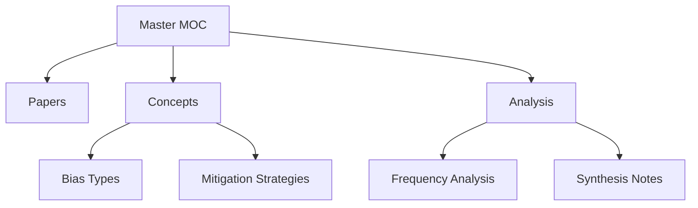

# MASTER MOC - Complete Vault Navigation

```
RESEARCH QUESTION:
How can feminist Digital/AI Literacies and diversity-reflective
prompting help to expose and mitigate bias and intersectional
discrimination in AI technologies?
```

## Vault Statistics

| Papers | Concepts | High-Freq | Categories |
|:------:|:--------:|:---------:|:----------:|
| **249** | **79** | **17** | **3** |

## Navigation Structure



## Top Concepts by Category

### Bias Types (Top 10)
1. [[Intersectionality]] `193x`
2. [[Discrimination]] `126x`
3. [[Stereotyping]] `73x`
4. [[Intersectional Accuracy]] `58x`
5. [[Stereotype]] `54x`
6. [[Algorithmic Bias]] `43x`
7. [[Stereotypen]] `40x`
8. [[Stereotypical]] `22x`
9. [[Algorithmic Discrimination]] `14x`
10. [[Intersectional Stereotypes]] `10x`

### Mitigation Strategies (Top 10)
1. [[Intersectionality]] `193x`
2. [[Debiasing]] `103x`
3. [[Intersectional Accuracy]] `58x`
4. [[Prompt Engineering]] `56x`
5. [[Feminist AI]] `32x`
6. [[Bias Mitigation]] `18x`
7. [[Fine-tuning]] `17x`
8. [[Bias Evaluation]] `13x`
9. [[Inclusive Ai]] `11x`
10. [[Intersectional Stereotypes]] `10x`

## Recent Papers (2024-2025)

- [[Incubating Feminist AI- Executive Summary 2021-2024]] (2024)
- [[Feminist perspectives on AI- Ethical considerations in algorithmic decision-making]] (2024)
- [[Artificial Intelligence Competence Needs for Youth Workers]] (2024)
- [[Artificial Intelligence Competence Needs for Youth Workers]] (2024)
- [[Social work in the age of artificial intelligence- A rights-based framework for evidence-based practice through social psychology, group dynamics, and institutional analysis]] (2025)
- [[Policy advice and best practices on bias and fairness in AI]] (2024)
- [[Coded injustice- Surveillance and discrimination in Denmark's automated welfare state]] (2024)
- [[Measuring gender and racial biases in large language models- Intersectional evidence from automated resume evaluation]] (2025)
- [[How to Create Inclusive AI Images- A Guide to Bias-Free Prompting]] (2025)
- [[Prompt Engineering Techniques for Mitigating Cultural Bias Against Arabs and Muslims in Large Language Models- A Systematic Review]] (2025)

*...and 129 more recent papers*

## Key Research Themes

Based on concept frequency analysis:

3. **Prompting Solutions**: Prompt-based mitigation discussed 66x

## Quick Links

### Core MOCs
- [[Index]] - Main navigation index
- [[Concept_Frequency]] - Frequency analysis
- [[Papers Index]] - All papers by year

### Your Workspace
- [[Synthesis/]] - Add your analysis here
- [[Research Notes]] - Create your notes
- [[Questions]] - Track open questions

## Useful Searches

Copy these into Obsidian search:

- `tag:#paper` - All research papers
- `tag:#concept` - All concepts
- `/\[\[.*Bias\]\]/` - Papers mentioning bias types
- `/frequency: [0-9]{2,}/` - High-frequency concepts
- `path:Synthesis` - Your synthesis notes

---

*Vault generated: 2026-02-22 14:27*  
*Total files: 333 | Python script: `generate_obsidian_vault_improved.py`*
